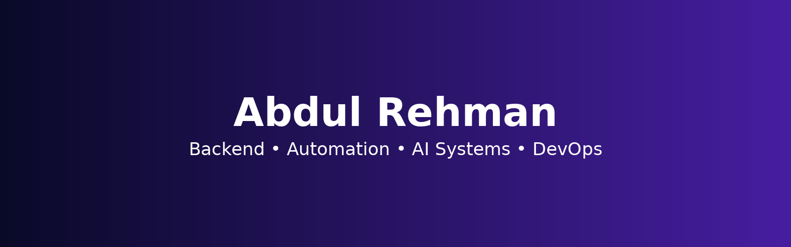

# Hi, I'm Abdul Rehman 👋

Software Engineer at **Careem** — building automation systems, AI-driven QA workflows, and cloud infrastructure.

---

### 🚀 Focus Areas
- ⚙️ Automation Systems & QA Engineering
- 🤖 AI-driven testing workflows & agents
- 🔗 API Design & Validation
- 🚀 CI/CD Pipelines
- ☁️ Cloud Infrastructure (AWS + Terraform)
- 📊 Observability & Performance Testing

---

### ⚙️ Tech Stack

---

### 📫 Connect
- 🌐 Portfolio: https://bawanyabdulrehman.github.io/portfolio/
- 💼 LinkedIn: https://www.linkedin.com/in/abdulrehmanbawany/
- 📧 Email: bawanyabdulrehman@gmail.com
